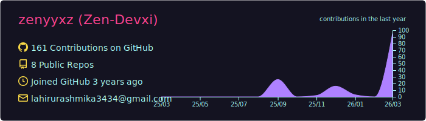
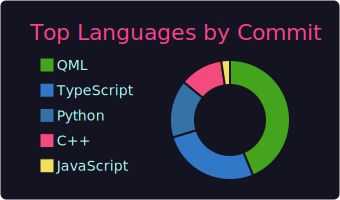
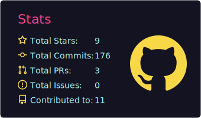

#  Hi, I'm Lahiru Rashmika

 Ethical Hacker |  Web Developer |  Bug Bounty Hunter |  Pen-Tester  

---

##  Tech Stack

---

##  GitHub Stats

---

##  Projects
-  [ShellForge](https://github.com/zenyyxz/ShellForge) – Custom payload generator for ethical hacking  
-  [V-Nexus](https://github.com/zenyyxz/V-nexus.git) – The ultimate V2Ray/Xray client for Windows. Fast, stable, and secure. 

---

##  Activity

---

##  Connect With Me
 Email: **admin@lahirux.dev**  
 Portfolio: **lahirux.dev**  
